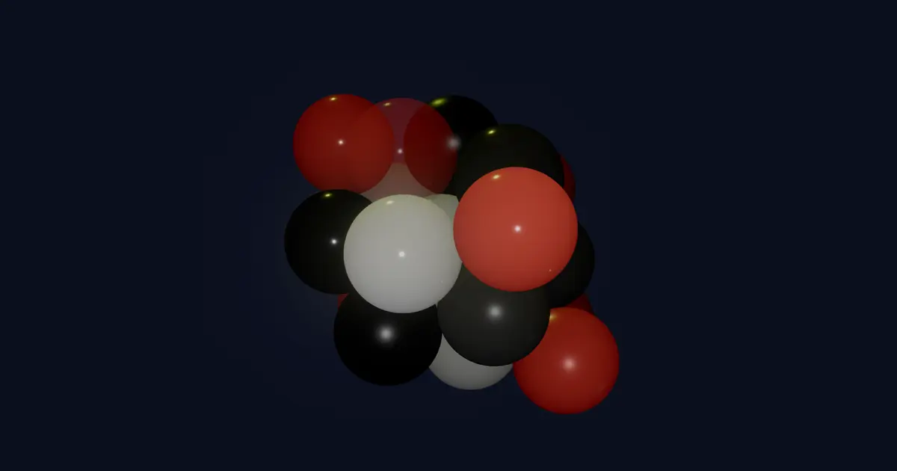

[]()

# Balls rapier physics

-   VUE + Three.js + Rapier3d
-   If using the non compat version, then you will need to install some plugins into Vite to allow importing the Rapier
    WASM binary.

```javascript
npm install vite-plugin-wasm --save-dev
npm install vite-plugin-top-level-await --save-dev
```

-   vite.config.js

```javascript
import { defineConfig } from 'vite'
import wasm from 'vite-plugin-wasm'
import topLevelAwait from 'vite-plugin-top-level-await'

export default defineConfig({
    plugins: [wasm(), topLevelAwait()]
})
```

-   using the non compat version, it is not necessary to run this line

```javascript
~~await RAPIER.init()~~
```

[demo](https://balls-rapier-physics.pages.dev/)
